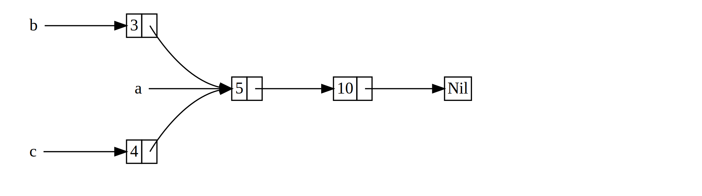

# Rc<T>, the reference counted smart pointer

In majority of cases ownership is clear and a single value is owned by a single owner. However there are certain cases a single value is owned by multiple owners. For example the graph data structures multiple edges might point to the same node and owned by multiple edges.

Let's take the cons list as an example again. To represent a list like this one -



You see there are two lists `b` and `c` point to the list `a`.

Implementing this with Box will result in errors -

```
// enum List {
//     Cons(i32, Box<List>),
//     Nil,
// }
//
// use crate::List::{Cons, Nil};
//
// fn main() {
//     let a = Cons(5, Box::new(Cons(10, Box::new(Nil))));
//     let b = Cons(3, Box::new(a));
//     let c = Cons(4, Box::new(a));
// }
//
// The above will give errors because the Box will own the list and cannot be shared.
//
//
// let a = Cons(5, Box::new(Cons(10, Box::new(Nil))));
//    |         - move occurs because `a` has type `List`, which does not implement the `Copy` trait
// 10 |     let b = Cons(3, Box::new(a));
//    |                              - value moved here
// 11 |     let c = Cons(4, Box::new(a));
//    |                              ^ value used here after move

```

Hence `Box<List>` can be changed to `Rc<List>`; This would let `b` and `c` to share `a`. The sharing is done by using `Rc::clone(&a)` instead of `a.clone()` which does deep copy. The `Rc::clone()` performs a shallow copy and increments the reference count. See the [example here](./shared_list/src/main.rs).

## Rc<T> and reference count

```
use std::rc::Rc;

fn main() {
    let five = Rc::new(5);
    let five_ptr = Rc::as_ptr(&five);
    println!("Rc (five): {}, address: {:#?}", five, five_ptr);
    let five_ref = Rc::clone(&five);
    let five_ptr = Rc::as_ptr(&five_ref);
    println!("Rc (five_ref): {}, address {:#?}", five_ref, five_ptr);
    // cloning increases reference count
    println!("number of references: {}", Rc::strong_count(&five));
}
```

Output -

```
Rc (five): 5, address: 0x0000563da171f9e0
Rc (five_ref): 5, address 0x0000563da171f9e0
number of references: 2
```


